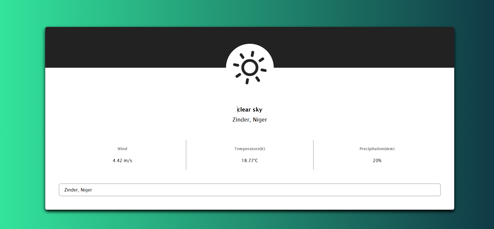
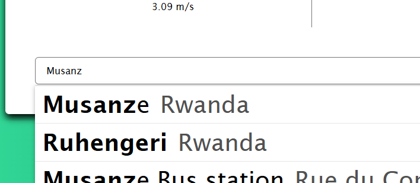
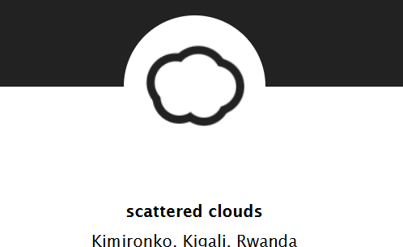

# 🌦️ Weather App

A simple and intuitive weather application that allows users to search for locations and view current weather conditions, including temperature (in Celsius), wind speed, and precipitation. Built using **HTML**, **CSS**, and **JavaScript**, with integrations like Google Maps API and OpenWeatherMap API for enhanced functionality.


## 🚀 Features

### 🌍 **Search Locations**
- **Google Maps Autocomplete**: Users can search for any location worldwide.
- Automatic fetching of latitude and longitude coordinates.

### 🌞 **Real-Time Weather Data**
- Displays key metrics:
  - Temperature (in Celsius).
  - Wind speed (in meters per second).
  - Humidity levels (as precipitation).
- Dynamic weather icons powered by **Skycons**.

---

## 📷 Screenshots



### **Search and Results**
Users can type in a location to receive accurate weather data.


### **Dynamic Weather Icons**
Icons change based on real-time weather conditions.


---

## 🛠️ Getting Started

These instructions will help you get a copy of the project running on your local machine.

---

### **Prerequisites**
Make sure you have the following installed:
- **Git**: [Download Git](https://git-scm.com/)
- **Node.js**: [Download Node.js](https://nodejs.org/)
- A code editor like **VS Code**: [Download VS Code](https://code.visualstudio.com/)

---

### **Installing**

Follow these steps to install and run the application on your machine:

1. **Clone the repository**:
   ```bash
   git clone https://github.com/yourusername/weather-app.git
   cd weather-app
   ```

2. **Install dependencies**:
   Run the following command to install the necessary dependencies.
   If the project uses `package.json` (Node.js):
   ```bash
   npm install
   ```
   If the project relies on other tools or libraries manually included, ensure they are downloaded using:
   ```bash
   npm install skycons
   npm install dotenv
   ```

3. **Set up environment variables**:
   - Create a `.env` file in the root directory of the project.
   - Add your API keys like this:
     ```env
     OPENWEATHER_API_KEY=your_openweather_api_key
     GOOGLE_MAPS_API_KEY=your_google_maps_api_key
     ```

4. **Run the application locally**:
   ```bash
   npm start
   ```
   This will start the development server. Open your browser and navigate to:
   ```
   http://localhost:3000
   ```

---

## 🌐 Deployment

To deploy the application:
1. **Host the project** on platforms like **Netlify**, **Vercel**, or **Heroku**.
2. Make sure the `.env` variables are properly configured in the deployment settings:
   - `OPENWEATHER_API_KEY`
   - `GOOGLE_MAPS_API_KEY`

---

## 🚧 Challenges Faced

### 1. Configuring Nginx to Serve the New Folder
One of the significant challenges during development was configuring **Nginx** to serve the newly created project folder. Ensuring the web server correctly pointed to the project’s build directory required careful adjustments to the Nginx configuration file. Key tasks included:
- Setting the `root` directive to point to the correct folder.
- Ensuring proper permissions for the folder.
- Testing the configuration to avoid downtime during deployment.

### 2. Automating Deployment to Reflect Changes After Every Push
Another challenge was automating the deployment process so that the website updates seamlessly after every code push. This involved:
- Setting up a  CI/CD pipeline to pull the latest changes on the server.
- Ensuring that the build process ran smoothly on the server.
- Restarting the necessary services like Nginx without causing interruptions.

Both tasks required learning new tools and debugging configurations, but they were ultimately rewarding as they streamlined the deployment process and made updates more efficient.


## 🤝 Contributing

Contributions are welcome! To contribute:
1. Fork the repository:
   ```bash
   git fork https://github.com/yourusername/weather-app.git
   ```
2. Create a feature branch:
   ```bash
   git checkout -b feature-name
   ```
3. Commit your changes:
   ```bash
   git commit -m "Add meaningful commit message"
   ```
4. Push to your branch:
   ```bash
   git push origin feature-name
   ```
5. Open a Pull Request to the `main` branch.

---

## 💡 Credits
- **APIs**:
  - [Google Maps/Places API](https://developers.google.com/maps/documentation)
  - [OpenWeatherMap API](https://openweathermap.org/api)
- **Icons**: [Skycons](https://github.com/darkskyapp/skycons)


---

## 📜 License
This project is licensed under the [MIT License](LICENSE).
```

